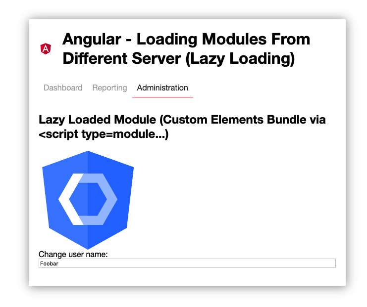

# Angular - Loading modules from different server (lazy loading)

This project demonstrates several ways to load multiple modules. 

* One way is to load *lazy modules* via the *router*. 
* Another way is to create an *custom elements* bundle and load it via script element: `<script type=module src="http://...>`"

The state (store) / context is shared between modules and application.
 
## Preview

This project was generated with [Angular CLI](https://github.com/angular/angular-cli) version 9.0.0-next.4.

## Start

`npm start` to start the demo.
  - creates an production build of admin (custom elements bundle) and copies it to the `server/module/admin` Folder.
  - starts the mock api server to provide modules information and admin bundle
  - starts the demo app
  

