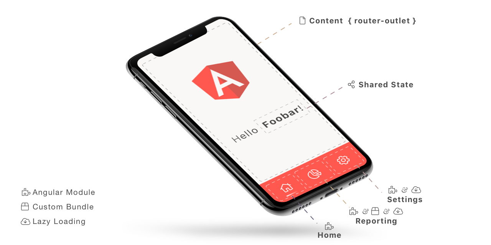

# Angular - Loading modules from different server (lazy loading)

This project demonstrates several ways to load multiple modules. 

* One way is to load *lazy modules* via the *router*. 
* Another way is to create an *custom elements* bundle and load it via script element: `<script type=module src="http://...>`"

The state (store) / context is shared between modules and application.

 
This project was generated with [Angular CLI](https://github.com/angular/angular-cli) version 9.0.0-rc.5.

## Prerequesits

- Node V. 10.13.x or later
- Angular CLI 9.0.0-rc.5

## Start

1. Clone this repository

2. `npm i` to intall all needed modules.

3. `npm start` to start the demo.

    - creates an production build of reporting (custom elements bundle) and copies it to the `server/module/reporting` Folder.
    - starts the mock api server to provide modules information and reporting bundle
    - starts the demo app
  

There you go: demo runs at [localhost:4200](http://localhost:4200/#/dashboard)
